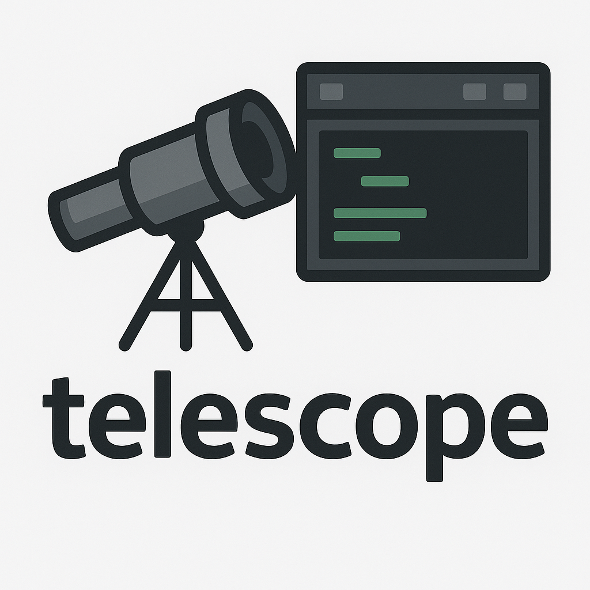

# Telescope
 Welcome to Telescope - a terminal/console program for the amateur astronomer.

***Note: Version 1.0 is a complete rewrite based on the [rcurses library](https://github.com/isene/rcurses)***

This application can help structure your telescopes and eyepieces. It will calculate properties of your scopes and EPs. Scope+EP combination properties are also calculated.

The top panel lists your telescopes and the lower panel shows the eyepieces. 

Here are the navigation keys and what they do:

Key         | Meaning
------------|-----------------------------------------------------------
t           | Add telescope (name,app,fl[,notes])
e           | Add eyepiece  (name,fl,afov[,notes])
ENTER       | Edit selected
TAB         | Switch panels
UP/DOWN     | Move cursor
Shift-UP    | Move item up
Shift-DOWN  | Move item down
HOME/END    | Jump to start/end
o           | Toggle order by Telescope APP and Eyepiece FL
SPACE       | Tag/untag
u           | Untag all
A           | Tag all (bulk operation)
Ctrl-o      | Create observation log with tagged equipment
x           | Export tagged items to CSV
X           | Export all items to JSON
v           | Show version information
D           | Delete item
r           | Refresh all panes
q/Q         | Quit (save/no save)
?           | Help

Telescope and eyepiece data is saved in the file '.telescope' in your home directory. The app now supports:

## What's New in Version 1.5

- **📝 Notes field**: Add optional notes to telescopes and eyepieces
- **📤 Export functionality**: Export tagged items to CSV or all items to JSON  
- **🏷️ Bulk operations**: Tag/untag all items at once with 'A'/'u' keys
- **🎨 Enhanced UI**: Color-coded background highlights for optimal eyepiece ranges
- **💾 Automatic backups**: Your data is automatically backed up (configurable)
- **⚙️ Configuration file**: Customize colors and settings via `~/.telescope_config`
- **✅ Input validation**: Improved error handling and validation
- **📦 Version checking**: Press 'v' to check for updates from RubyGems

## Configuration

Create a file `~/.telescope_config` to customize colors and settings. See `.telescope_config_example` for available options.

## Installation
You can install telescope by simply coloning this repo and put the file `telescope` in your "bin" directory. Or you can simply do `gem install telescope-term`.

After installation, fire up the program and press '?' to display the help text.

## List of telescope abbreviations

Abbreviation | Meaning
-------------|-----------------------------------------------------------
APP          | Apperature (in millimeters)                                      
FL           | Focal Length (in millimeters)                                    
F/?          | Focal ratio (FL/APP)                                             
\<MAG        | Maximum magnitude visible                                        
xEYE         | Light gathering compared to the human eye                        
MINx         | Minimum usable magnification (may be lower for refractors)
MAXx         | Maximum usable magnification
SEP-R        | Minimum separation, Rayleigh limit
SEP-D        | Minimum separation, Dawes limit
\*FLD        | Recommended eyepiece for star fields
GLXY         | Recommended eyepiece for galaxies and nebulae
PLNT         | Recommended eyepiece for planets and globular clusters
DBL\*        | Recommended eyepiece for planet details and double stars
\>2\*\<      | Recommended eyepiece for tight double stars
MOON         | Minimum feature resolved on the Moon (in meters)
SUN          | Minimum feature resolved on the Sun (in kilometers)

## List of eyepiece abbreviations

Abbreviation | Meaning
-------------|-------------------------------------------------------------                                           
FL           | Focal Length (in millimeters)      
AFOV         | Apparent Field Of View             
MAGX         | Magnification (with that telescope)
TFOV°        | True Field Of View (deg/min/sec)   
PPL          | Exit pupil (in millimeters)        
2blw         | Magnification with that telescope and a 2x Barlow lens      
tfov         | True Field Of View with the 2x Barlow lens
ppl          | Exit pupil with the 2x Barlow lens

## Screenshot

