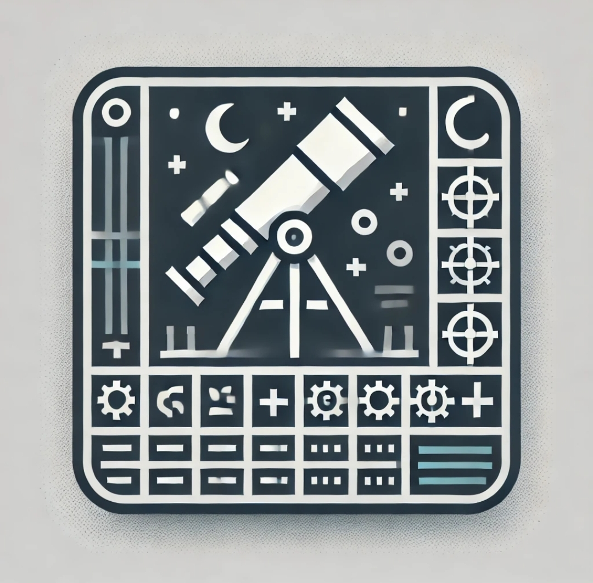

# Telescope
 Welcome to Telescope - a terminal/console program for the amateur astronomer.

The top panel lists your telescopes with eyepieces in the lower panel. Add a telescope by pressing 't' and fill in the name, the apperature (APP) and the focal length (FL) in the "command line" at the bottom and press ENTER. Add an eyepiece with 'e' and enter a name, the focal length (FL) and apparent field of view (AFOV) and press ENTER. Select items by using the TAB/ UP/DOWN cursor keys. Press ENTER on a selected item to change the values in the command line. Delete an item by pressing 'D'. Move an with PgUP/PgDown keys. Sort telescopes with 'T' (toggles sorting by the first thre columns; Name, APP, FL). Sort eyepieces in the same way with the 'E' key.

Tag items with the SPACE key (untag all with 'u'), then press 'o' to create an observation log file (content shown in the lower panel).

Refresh all panels with the 'r' key. Escape the selected panels or the command line by pressing 'Ctrl-G'. Quit via 'q' (or 'Q' if you don't want to save your edits since last session). Save a backup session with 'b' and load a saved backup session with the 'B' key.

Telescope and eyepiece data is saved in the file '.telescope' in your home directory (backup file is '.telescope.bu').

## Installation
You can install telescope by simply coloning this repo and put the file `telescope` in your "bin" directory. Or you can simply do `gem install telescope-term`.

In order to run telescope (without generating [a bunch of warnings](https://github.com/isene/RTFM/issues/1)), you need to do a `gem install curses` (gets version 1.3.2) instead of installing via `apt install ruby-curses` (gets version 1.2.4-1build1 on Ubuntu 20.04). The installation via gem automatically takes care of this.

After installation, fire up the program and press '?' to display the help text.

## List of telescope abbreviations

Abbreviation | Meaning
-------------|-----------------------------------------------------------
APP          | Apperature (in millimeters)                                      
FL           | Focal Length (in millimeters)                                    
F/?          | Focal ratio (FL/APP)                                             
\<MAG        | Maximum magnitude visible                                        
xEYE         | Light gathering compared to the human eye                        
MINx         | Minimum usable magnification (may be lower for refractors)
MAXx         | Maximum usable magnification
\*FIELD      | Recommended magnification for star fields
GX/NEB       | Recommended magnification for galaxies and nebulae
PL/GCL       | Recommended magnification for planets and globular clusters
PLd/2\*      | Recommended magnification for planet details and double stars
TGHT2\*      | Recommended magnification for tight double stars
DL-SEP       | Minimum separation, Dawes limit
RC-SEP       | Minimum separation, Rayleigh limit
MOON         | Minimum feature resolved on the Moon (in meters)
SUN          | Minimum feature resolved on the Sun (in kilometers)

## List of eyepiece abbreviations

Abbreviation | Meaning
-------------|-------------------------------------------------------------                                           
FL           | Focal Length (in millimeters)      
AFOV         | Apparent Field Of View             
xMAGN        | Magnification (with that telescope)
FOV          | True Field Of View (deg/min/sec)   
XPUP         | Exit pupil (in millimeters)        

## Screenshot

